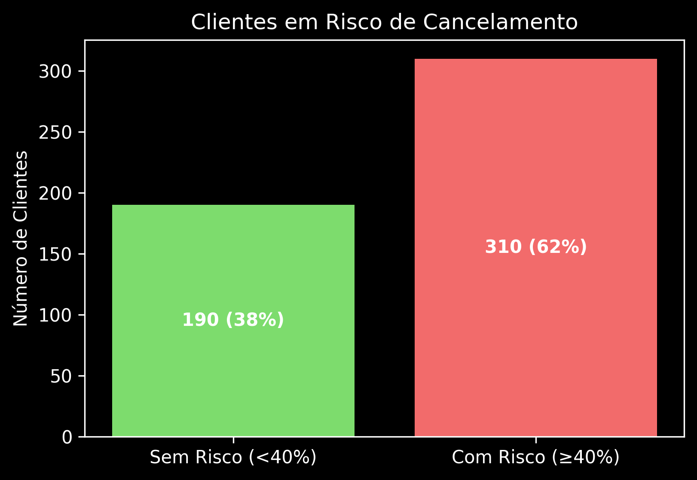
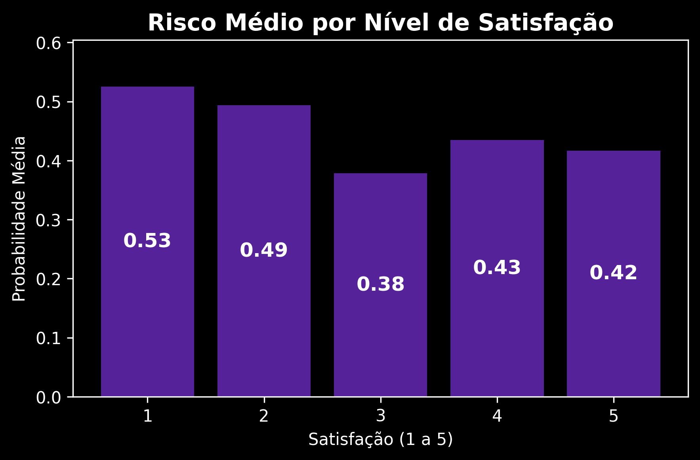

# 📊 Predição de Cancelamento de Clientes (Churn Prediction)

Este projeto tem como objetivo **analisar e prever o risco de cancelamento de clientes (Churn)** em uma base fictícia.  
Foi criado um pipeline que combina **Machine Learning, SQL e Python (pandas + matplotlib)** para gerar insights estratégicos que poderiam ser aplicados em uma empresa real.

---

## 📌 Sumário
- [⚙️ Tecnologias Utilizadas](#️-tecnologias-utilizadas)
- [📂 Estrutura do Projeto](#-estrutura-do-projeto)
- [🚀 Etapas do Projeto](#-etapas-do-projeto)
- [📊 Visualizações](#-visualizações)
- [💡 Insights de Negócio](#-insights-de-negócio)
- [💻 Exemplos de Código](#-exemplos-de-código)
- [🎯 Possíveis Ações](#-possíveis-ações)
- [🔮 Melhorias Futuras](#-melhorias-futuras)
- [✍️ Autora](#️-autora)

---

## ⚙️ Tecnologias Utilizadas
- **Python** → Pandas, Matplotlib, Scikit-learn, Joblib  
- **SQL (MySQL)** → Filtros e consultas  
- **Jupyter Notebook** → Análise exploratória e visualização  
- **Machine Learning** → Random Forest Classifier  

---

## 📂 Estrutura do Projeto
projeto_churn/
├── dados/
│   ├── clientes_ativos.csv              # Base inicial (sem score)
│   ├── clientes_ativos_com_score.csv    # Base após predição
│   ├── clientes_churn.csv               # Dados usados no treino
│   └── clientes_cadastro.csv            # Informações cadastrais
│
├── notebooks/
│   ├── churn.treino.ipynb               # Treinamento do modelo
│   ├── clientes.ativos.ipynb            # Aplicação do modelo + análises
│   └── IA.ipynb                         # Testes gerais
│
├── modelo_churn.pkl                     # Modelo treinado salvo
│
├── graficos/
│   ├── barras_risco.png
│   ├── hist_probs.png
│   └── risco_por_satisfacao.png
│
└── README.md                            # Documentação

---

## 🚀 Etapas do Projeto

### 1️⃣ Treinamento do Modelo
- Utilizado **RandomForestClassifier** para prever se o cliente iria cancelar.  
- Métricas avaliadas: **acurácia, recall, precisão**.  
- Modelo salvo em `modelo_churn.pkl` via `joblib` para reuso.  

### 2️⃣ Predição nos Clientes Ativos
- Base: `clientes_ativos.csv` (sem status de cancelamento).  
- Após aplicar o modelo, foram geradas as colunas:  
  - `ProbCancelamento` → probabilidade prevista pelo modelo.  
  - `Previsto` → 0 = não cancela, 1 = cancela.  
  - `Risco (>=0.40)` → regra de negócio: clientes acima de 40% de risco são considerados em risco.  

### 3️⃣ Análises no SQL
Exemplo de consultas realizadas:

```sql
-- Seleciona clientes em risco
SELECT Nome, ProbCancelamento
FROM churn_ativos
WHERE Risco >= 0.40
ORDER BY ProbCancelamento DESC;

-- Média de satisfação, compras e meses dos clientes em alto risco
SELECT AVG(Satisfacao), AVG(QtdCompras), AVG(MesesComoCliente)
FROM churn_ativos
WHERE ProbCancelamento >= 0.70;

## 📊 Visualizações
Foram criados gráficos em matplotlib (dark mode) para facilitar a análise:
1.Distribuição da Probabilidade de Cancelamento
2.Clientes em Risco vs Sem Risco
3.Risco Médio por Nível de Satisfação

### Distribuição da Probabilidade de Cancelamento


### Clientes em Risco vs Sem Risco


### Risco Médio por Nível de Satisfação


💡 Insights de Negócio

🔴 62% dos clientes ativos estão em risco de cancelamento.
🟠 Clientes com satisfação baixa (1 e 2) apresentam risco médio de até 53%.
🟢 Mesmo clientes com nota máxima de satisfação (5) ainda têm risco médio de 42%, mostrando que outros fatores (tempo de cliente, quantidade de compras, plano contratado) influenciam fortemente.

📌 As variáveis mais importantes no modelo foram:
• QtdCompras
• MesesComoCliente
• Idade
• Satisfacao

💻 Exemplos de Código

Predição com modelo salvo


